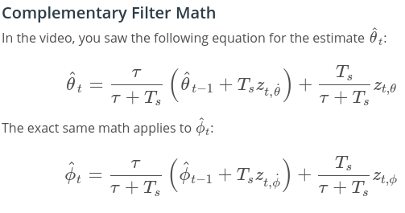

# Estimation Project #

In this project the estimation portion of the drone controler is implemented and used for the CPP simulator.  The goal of the project is to have the simulated quad flying with the estimator and the previously implemented custom controller.

This README is broken down into the following sections:

 - [Setup](#setup) - the environment and code setup required
 - [The Tasks](#the-tasks) - the tasks you will need to complete for the project
 - [Tips and Tricks](#tips-and-tricks) - some additional tips and tricks you may find useful along the way
 - [Submission](#submission) - overview of the requirements for your project submission

## Setup ##

This project will continue to use the C++ development environment you set up in the Controls C++ project.

 1. Clone the repository
 ```
 git clone https://github.com/davidsosa/drone-estimation
 ```
All the needed dependencies to run the simulator are included in this repository.

### Project Structure ###

 - Parameters for tuning the EKF are in the parameter file `QuadEstimatorEKF.txt`

 - We can turn on various sensors (the scenarios configure them, e.g. `Quad.Sensors += SimIMU, SimMag, SimGPS`), additional sensor plots will become available to see what the simulated sensors measure.

 - The EKF implementation exposes both the estimated state and a number of additional variables. In particular:

   - `Quad.Est.E.X` is the error in estimated X position from true value.  More generally, the variables in `<vehicle>.Est.E.*` are relative errors, though some are combined errors (e.g. MaxEuler).

   - `Quad.Est.S.X` is the estimated standard deviation of the X state (that is, the square root of the appropriate diagonal variable in the covariance matrix). More generally, the variables in `<vehicle>.Est.S.*` are standard deviations calculated from the estimator state covariance matrix.

   - `Quad.Est.D` contains miscellaneous additional debug variables useful in diagnosing the filter. You may or might not find these useful but they were helpful to us in verifying the filter and may give you some ideas if you hit a block.

#### `config` Directory ####

In the `config` directory, in addition to finding the configuration files for your controller and your estimator, we have the configuration files for each of the simulations.

As an example, if we look through the configuration file for scenario 07, we see the following parameters controlling the sensor:

```
# Sensors
Quad.Sensors = SimIMU
# use a perfect IMU
SimIMU.AccelStd = 0,0,0
SimIMU.GyroStd = 0,0,0
```
This configuration tells us that the simulator is only using an IMU and the sensor data will have no noise.  You will notice that for each simulator these parameters will change slightly as additional sensors are being used and the noise behavior of the sensors change.

## The Tasks ##

Project outline:

 - [Introduction](#Introduction)
 - [Step 1: Sensor Noise](#step-1-sensor-noise)
 - [Step 2: Attitude Estimation](#step-2-attitude-estimation)
 - [Step 3: Prediction Step](#step-3-prediction-step)
 - [Step 4: Magnetometer Update](#step-4-magnetometer-update)
 - [Step 5: Closed Loop + GPS Update](#step-5-closed-loop--gps-update)
 - [Step 6: Adding Your Controller](#step-6-adding-your-controller)

### Introduction

The Kalman Filter is an iterative method to combine sequential measurements
in the precence of sensor and model uncertainties. The Kalman Filter is part
of the group of Bayesian Filters. Roughly the Kalman Filter consists of two
parts. In these two parts we calculate the state and the error of the systems
(usually called the covariance).

1. Predition/Estimation/Model/Motion Update
   Here we use our previous knowledge of the the systems. Here we can use physics equations (motion models) in order to estimate where an object is currently located by using the previous measurement `t-1`. In this step the
   model error or process noise is added to the state and to the covariance
   in order to have a realistic measure.

   

2. Measurement Update
   The first part of the measurement update, we get a very important quantity
   called the residual which is the differece between the estimated measurements is subtracted from the measurement value. Then we calculate
   the Kalman gain, which in very simple terms looks like this:
   `estimated_error / measured_error + estimated_error`, which tell us how much we will thurst the estimated value more over the measured value.

   We then update the state and covariance matrices using the Kalman Gain.
   In this step we also take into account the noise that may be present in the sensors

   

   The Kalman Filter is very similar to the Extended Kalman Filter. The extra thing we need to do with the EKF is to compute the Jacobian of the transition matrix F and the measurements matrix H. These Jacobians correspond to the first-order Taylor approximation of the F and H matrices.

### Step 1: Sensor Noise ###

1. For the first step, we collect some simulated noisy sensor data and estimate the standard deviation of the quad's sensor.

2. Choosing scenario `06_NoisySensors`. When this scenario is run, the graphs we see a recorded to the following csv files with headers: `config/log/Graph1.txt` (GPS X data) and `config/log/Graph2.txt` (Accelerometer X data).

3. The logged files are processed to figure out the standard deviation of the the GPS X signal and the IMU Accelerometer X signal.

Task: The calculated standard deviations for the GPX X signal and the IMU
Acceleromenter X signal are calculated with `python_scripts/calculate_std.py`
and the results are:

```
('QuadGPSX std:', 0.68835404325708893)
('QuadIMUAX std:', 0.47471341799108197)
```

4. We plug in these results into the top of `config/6_Sensornoise.txt`.

5. We now run the simulator. The dashed lines in the simulation turn eventually green, indicating we are capturing approx 68% of the respective measurements (which is what we expect within +/- 1 sigma bound for a Gaussian noise model).


### Step 2: Attitude Estimation ###

Now we proceed with the first step to our state estimation: including information from our IMU.  In this step, we a complementary filter-type attitude filter.

#### Task 2 Completion

To complete this task the following formulas from the lectures where used:



But first we convert the body rates from the gyro to the world-coordinate Euler angles and we use these to get the `predictedRoll` and `predictedPitch`.
The measured roll and pitch is obtained from the accelerometer values. The figure below shows that with this implementation the test is passed.


**See section 7.1.2 of [Estimation for Quadrotors](https://www.overleaf.com/read/vymfngphcccj) for a refresher on a good non-linear complimentary filter for attitude using quaternions.**

### Step 3: Prediction Step ###

In this next step we implement the prediction step of the filter.

1. Run scenario `08_PredictState`.  This scenario is configured to use a perfect IMU (only an IMU). Due to the sensitivity of double-integration to attitude errors, we've made the accelerometer update very insignificant (`QuadEstimatorEKF.attitudeTau = 100`).  The plots on this simulation show element of your estimated state and that of the true state.  At the moment you should see that your estimated state does not follow the true state.

2. In `QuadEstimatorEKF.cpp`, the state prediction step in the `PredictState()` functon is implemented. We check this is correct by running the scenario `08_PredictState`. Here it is observed  the estimator state track the actual state, with only reasonably slow drift, as shown in the figure below:


3. Now we introduce a realistic IMU, one with noise.  Run scenario `09_PredictionCov`. We see a small fleet of quadcopter all using your prediction code to integrate forward. We observed two plots:
   - The top graph shows 10 (prediction-only) position X estimates
   - The bottom graph shows 10 (prediction-only) velocity estimates
You will notice however that the estimated covariance (white bounds) currently do not capture the growing errors.

4. In `QuadEstimatorEKF.cpp`, calculate the partial derivative of the body-to-global rotation matrix in the function `GetRbgPrime()`.  Once you have that function implement, implement the rest of the prediction step (predict the state covariance forward) in `Predict()`.

After a tuning the obtained results is shown in the image above. It looks very similar to the correct scenario presented in the previous images.

5. Run your covariance prediction and tune the `QPosXYStd` and the `QVelXYStd` process parameters in `QuadEstimatorEKF.txt` to try to capture the magnitude of the error you see. Note that as error grows our simplified model will not capture the real error dynamics (for example, specifically, coming from attitude errors), therefore  try to make it look reasonable only for a relatively short prediction period (the scenario is set for one second).
#### Task 3 Implementation

For this task the state vector containing `x,y,z,x_dot,y_dot,z_dot,yaw` is advanced using
the state transition matrix presented in the lectures (Eq 49). This is a straightforward integration for `x,y,z`. For `x_dot,y_dot,z_dot` we need to convert the acceleration from the body frame to the inertial frame. We used the provided quaternion to achieve this.

With the inertial acceleration we are able to advance the state for `x_dot,y_dot,z_dot`. For `z_dot` we take care to subtract the minus term coming from gravity.

The second part of this task is to create the partial derivative matrix that is needed for the EFK.
The matrix is obtained from the lectures and the corresponding entries are filled in the `GetRbgPrime`
function. Then this funcion is used in the `Predict` function. Since the state has already been predicted, is this function all the is left to predict is the covariance matrix.


### Step 4: Magnetometer Update ###

Up until now we've only used the accelerometer and gyro for our state estimation.  In this step, you will be adding the information from the magnetometer to improve your filter's performance in estimating the vehicle's heading.

1. Run scenario `10_MagUpdate`.  This scenario uses a realistic IMU, but the magnetometer update hasn’t been implemented yet. As a result, you will notice that the estimate yaw is drifting away from the real value (and the estimated standard deviation is also increasing).  Note that in this case the plot is showing you the estimated yaw error (`quad.est.e.yaw`), which is drifting away from zero as the simulation runs.  You should also see the estimated standard deviation of that state (white boundary) is also increasing.
#### Task 4 Implementation

This is a simple measurement update taken from the `Estimation for Quadrotors` document. Below an image of the result:


### Step 5: Closed Loop + GPS Update ###

1. Run scenario `11_GPSUpdate`.  At the moment this scenario is using both an ideal estimator and and ideal IMU.  Even with these ideal elements, watch the position and velocity errors (bottom right). As you see they are drifting away, since GPS update is not yet implemented.

2. Let's change to using your estimator by setting `Quad.UseIdealEstimator` to 0 in `config/11_GPSUpdate.txt`.  Rerun the scenario to get an idea of how well your estimator work with an ideal IMU.

3. Now repeat with realistic IMU by commenting out these lines in `config/11_GPSUpdate.txt`:
```
#SimIMU.AccelStd = 0,0,0
#SimIMU.GyroStd = 0,0,0
```

4. Tune the process noise model in `QuadEstimatorEKF.txt` to try to approximately capture the error you see with the estimated uncertainty (standard deviation) of the filter.

5. Implement the EKF GPS Update in the function `UpdateFromGPS()`.

6. Now once again re-run the simulation.  Your objective is to complete the entire simulation cycle with estimated position error of < 1m (you’ll see a green box over the bottom graph if you succeed).  You may want to try experimenting with the GPS update parameters to try and get better performance.

#### Task 5 Realization

Task 5 is implemented with a simple update call. The image below shows the green box showing that the path of the drone stays within an error of < 1m.


### Step 6: Adding Your Controller ###

Up to this point, we have been working with a controller that has been relaxed to work with an estimated state instead of a real state.  So now, you will see how well your controller performs and de-tune your controller accordingly.

1. We now replace `QuadController.cpp` with the controller written in the last project.

2. We replace `QuadControlParams.txt` with the control parameters for last project.

The code from the previous project was placed in the correspinding files. There was very little tuning needed. Below an image of the test passing.

